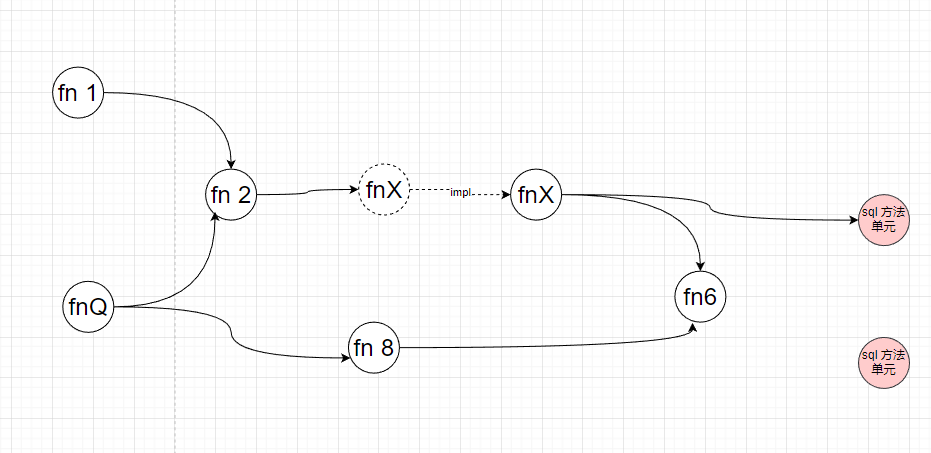

## 目标

> 通过解析和整理源码，  整理出项目的 方法调用链路   ，  从而方便整理出项目的   方法调用图 
>
> 基于项目的方法调用图 ，  可以方便梳理，
>
> 


### 方法调用图




## 使用方式

> 修改 application.yaml的配置  ，主要是 analysis开头的配置
> analysis.targetDirs  :  解析的字节码目录 和 一些需要配合解析的 依赖库目录
> analysis.sqlXmlBaseDirs  : mapper对应的xml 解析目录
> 启动项目
> 访问项目swagger页面 快速调用接口  http://localhost:8656/doc.html


## 示例产出文件

 

## 实现方案


> - 通过 解析java 字节码 .class，整理出   【类 - 方法  - 方法代码块】  数据
> - 解析所有的类，整理出所有的 method节点，还有 method之间的调用关系 ：methodA  --call-->  methodB
> - 解析 sql的 mapper xml文件 ，整理出  mapper接口和  sql块的 映射关系  ， 实现通过表名找到 对应的 method
> - 再以这些 method 为根节点， 再这些 方法引用图中找到  其他引用的节点
>
> 


## 使用到的库


### 解析代码 内容

| 功能           | 库                                                 | maven                                              |
| -------------- | -------------------------------------------------- | -------------------------------------------------- |
| 解析.class内容 | https://soot-oss.github.io/SootUp/getting-started/ | https://soot-oss.github.io/SootUp/getting-started/ |


#### sootUp

> sootup 是一个开源的 专注静态分析 的库，常用在学术领域
>
> 我们可以借用它的 强大语法树解析功能，帮我们梳理函数调用链路


必要参数

| 参数       | 解释                                                         |      |
| ---------- | ------------------------------------------------------------ | ---- |
| targetDirs | 待解析的字节码文件目录  一般是项目编译之后的target目录的  `target\classes` 还有   `JAVA_HOME\lib\rt.jar` |      |
|            |                                                              |      |
|            |                                                              |      |


##### 解析目标字节码

```java

```


##### 制定方法入口，搜索对应调用方法

```java

```


```java

```


### 解析 xml内容 

```java

```


